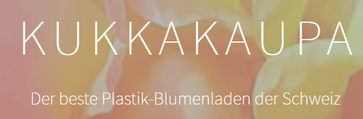

+++
title = "Ü𝖇𝖊𝖗𝖆𝖗𝖇𝖊𝖎𝖙𝖚𝖓𝖌 𝖉𝖊𝖘 𝕭𝖑𝖔𝖌𝖘 + 𝕰𝖎𝖌𝖊𝖓𝖊 𝖂𝖊𝖇𝖘𝖎𝖙𝖊"
date = "2020-08-19"
draft = false
pinned = false
image = "whatsapp-image-2020-08-19-at-15.03.07.jpeg"
+++
**Blog verschönern:**\
Heute habe ich als erstes diesen Blog noch ein bisschen schöner Gestaltet. Ich habe einige Bilder eingefügt, das Icon und Logo verändert, sowie auch den letzten Beitrag etwas aufgepäppelt. 

**Eigene Website erstellen:**\
Danach erhielten wir den Auftrag zu zweit eine Website, eines Blumenladens zu erstellen. Ich habe diese Aufgabe mit Isabelle gemeistert, da wir später ja ebenfalls zusammenarbeiten wollen. Hier wäre der Link zu unserer Website: <https://kukkakaupa.carrd.co/>

Wir haben die Website mit carrd.co erstellt. Die Bilder sind von Isabelle, so mussten wir keine Eigene machen gehen. Jedenfalls fand ich es persönlich ziemlich mühsam so eine Website zu erstellen. Zum einen gab es ein paar Sachen die ein wenig zu kompliziert sind. Aber sonst bin ich sehr zufrieden für das, dass wir nur 90 Minuten Zeit hatten. Grundsätzlich könnte man so ziemlich gut und schnell Geld verdienen. Ich bräuchte nur noch ein bisschen Übung. ;D