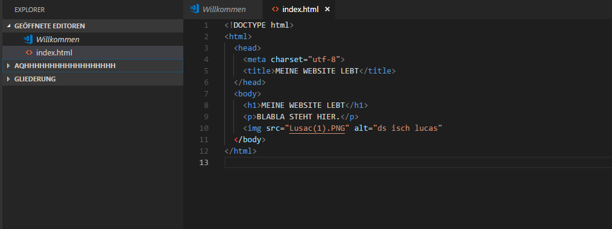

+++
title = "Code.exe | Programmieren mit CSS"
date = "2020-11-04"
draft = false
pinned = false
image = "maxresdefault.jpg"
+++
Heute habe ich Hauptsächlich am Programmier-Tutorial weitergemacht. Dort habe ich gelernt wie man mit CSS arbeitet. CSS bringt Farbe in die Website. Ich habe mit spass etwas herumprobiert und habe glaube ich begriffen. Wie es funktioniert. Hier die Website auf Edge und darunter das Bild in Code.exe: 

Ausserdem haben Isabelle und Ich die Planung für unser Projekt gemacht. Dort haben wir Ziele und Aufgaben definiert.