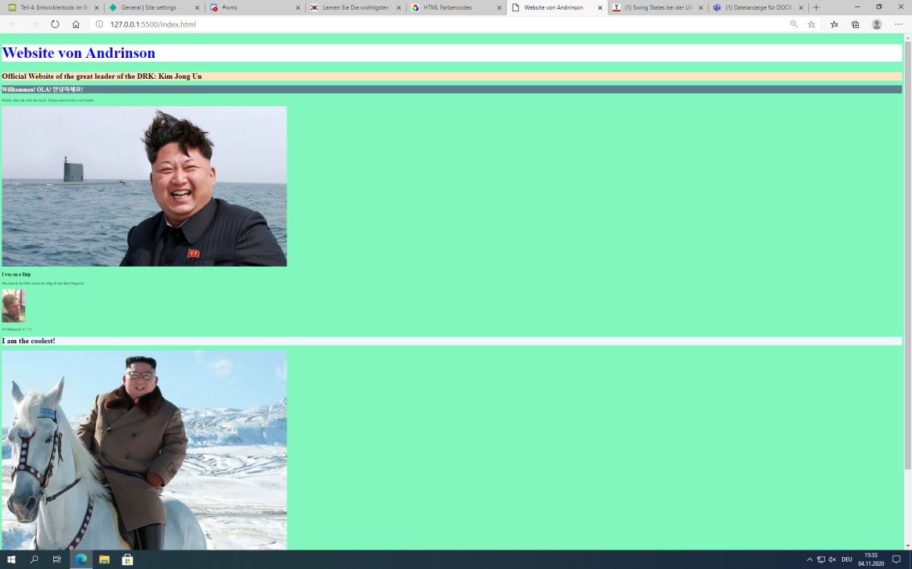
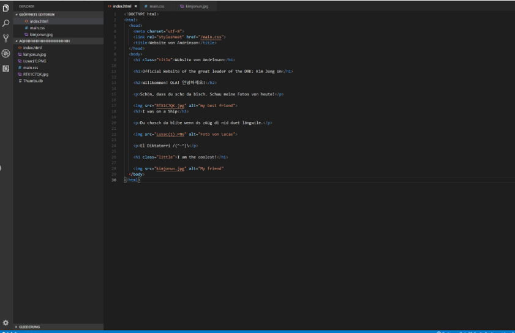

+++
title = "Code.exe | Programmieren mit CSS"
date = "2020-11-04"
draft = false
pinned = false
image = "maxresdefault.jpg"
+++
Heute habe ich Hauptsächlich am **Programmier-Tutorial** weitergemacht. Dort habe ich gelernt wie man mit CSS arbeitet. CSS bringt Farbe in die Website. Ich habe mit spass etwas herumprobiert und habe glaube ich begriffen. Wie es funktioniert. Der Link des Tutorial: https://code.makery.ch/de/library/html-css/part4/

  Hier die Website auf Edge und darunter das Bild in Code.exe: 

Ausserdem haben Isabelle und Ich die **Planung** für unser Projekt gemacht. Dort haben wir Ziele und Aufgaben definiert. Jedenfalls für November haben wir uns einiges Vorgenommen und auch im Dezember ist der terminplan voll. Wir haben einiges zu tun bis wir eine eigene Website haben.

Im Unterricht war natürlich heute auch die **Präsidentschaftswahl** in den **USA**. Wir haben eigentlich laufend auf die Tabelle geschaut, um immer gut informiert zu sein. Die grosse Frage: Biden oder Trump?, ging natürlich auch durch die Klasse. Politische Themen sind meiner Meinung nach immer schwierig und mühsam anzuschauen und beizusteuern. Auch die TV-Debatte zwischen Trump und Biden war ähnlich.