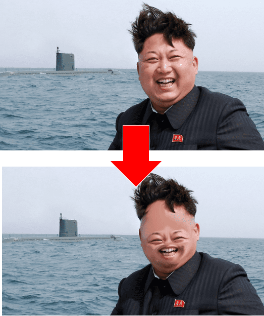

+++
title = "GIMP"
date = "2020-11-18"
draft = false
pinned = false
image = "gim-2-10-titel.jpg"
+++
## GIMP

Heute haben Isabelle und Ich GIMP erkundigt. Das ist eine Gratis-Version des bekannten Fotobearbeitungsprogramm Photoshop. Es ist ein bisschen anders als Photoshop, welches ich bereit im Gymnasium benützt habe. Alles etwas unübersichtlicher und etwas weniger Funktionen was die Sachen aber nicht schwieriger oder schlechter macht. Hier ein paar Beispiele: 

")

Für Anoja konnte ich bereits einen ersten "Auftrag" ausführen. Ich habe Ihr bei einem Bild das Logo ausgeschnitten ohne den Hintergrund zu verändern.  Man kann aber auch lustige Sachen mit Gimp machen wie das zum Beispiel:

### Planung

Heute war mehr ein Hineinlernen und arbeiten in Gimp. Nächstes Mal würden wir bereits erste Storys schreiben mit dem dazugehörigen Bild natürlich. Das wäre dann ein weiterer Schritt in Richtung Programmieren der eigenen Website. Unser Ziel ist es bis ende Jahr auch etwas vorweisen zu können.