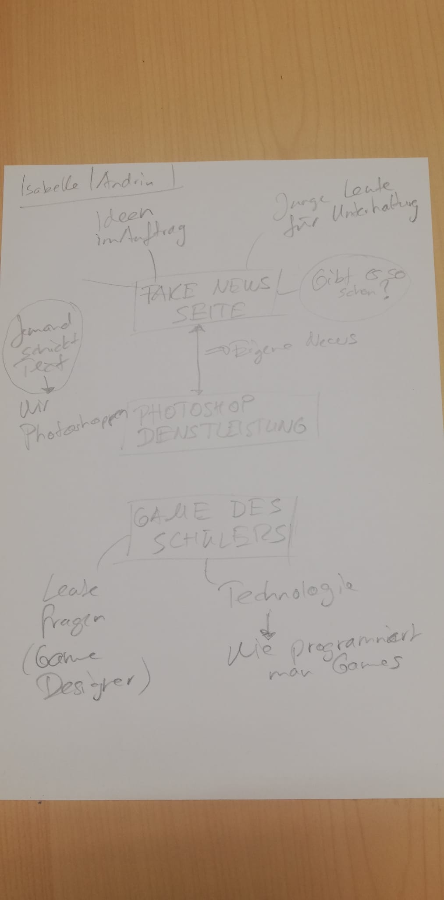
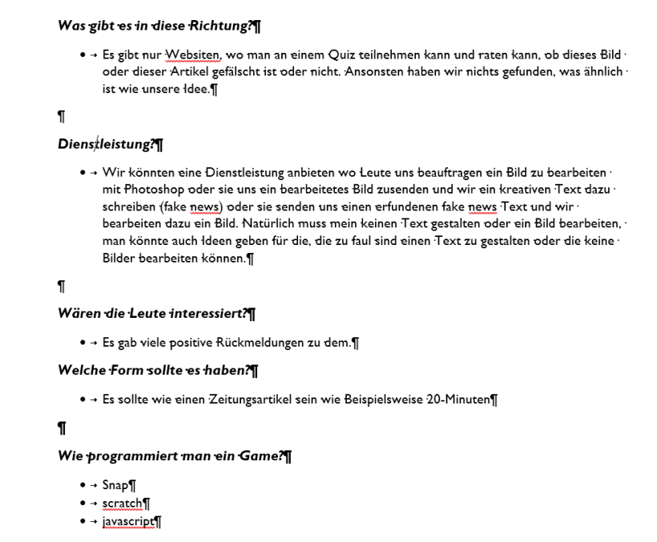

+++
title = "𝓘𝓭𝓮𝓮𝓷 𝓿𝓮𝓻𝓫𝓮𝓼𝓼𝓮𝓻𝓽"
date = "2020-09-02"
draft = false
pinned = false
image = "gi.png"
+++
**02.09.2020**

Heute haben wir unsere Ideen die wir ganz am Anfang hatten, ein wenig vertieft. Dazu haben wir uns zuerst Sachen überlegt.

**Unsere Ideen:**

* Fake-News Website

  * Dort können uns auch andere Personen Aufträge geben. 
  * Andere Personen sollen auch Beiträge hochladen können.
  * Eine Dienstleistung daraus machen
  * Es soll die Personen die sie besuchen Unterhalten.
* Game

  * Wir wollen evtl. auch ein Game programmieren
  * Es soll ein Arcade-Game werden. Ähnlich zu Super Mario
  * Dazu wollen wir natürlich auch einen Games-Entwickler fragen, was er uns für Tipps geben könnte.

Diese Ideen haben wir dann auch Marco mitgeteilt. Er gab uns ein paar Tipps wie wir das ganze angehen sollen. Seine Tipps seht ihr hier unten. Darunter ein paar Sachen von Isabelle und mir. Vor allem Isabelle hat viel Recherchiert, was es schon gibt oder wie man es machen könnte.

Das Game und auch die Website würden viel Arbeit werden. Für das Game habe ich ein paar Programmier-Arten herausgesucht. Unteranderem habe ich Snap gebraucht. Mit Snap habe ich schon am Gymnasium gearbeitet. Jedoch könnte man auch Scratch oder Java gebrauchen, um ein Game zu erstellen. Es wäre mit Snap fast am einfachsten. Jedoch auch nicht sehr schön am Schluss.