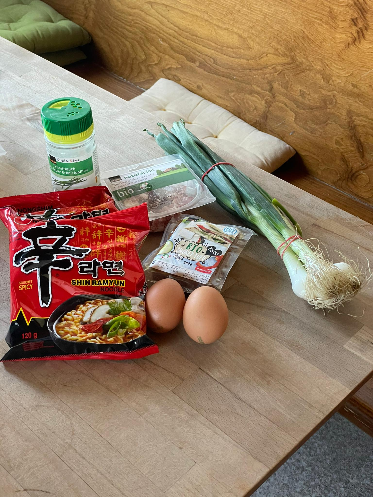
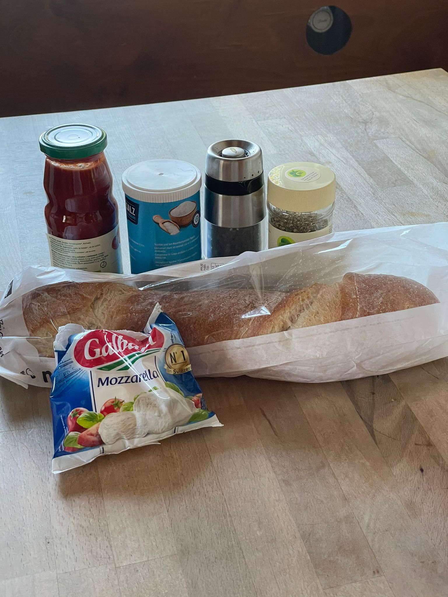
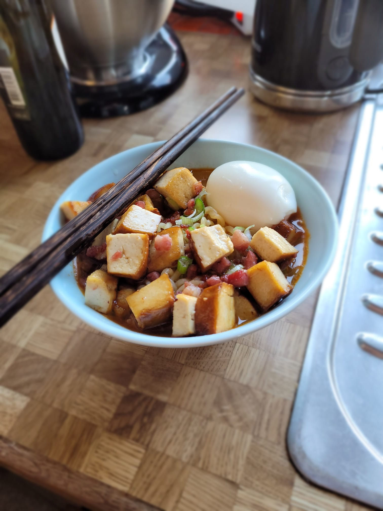

+++
title = "Kochtest"
date = "2021-03-31"
draft = false
pinned = false
image = "whatsapp-image-2021-03-31-at-15.41.47.jpeg"
+++
##### Gerichte Nachkochen

Heute haben Isabelle und Ich 2 Rezepte von Larissa und Nathalia nachgekocht. Dafür gingen wir zu mir nach hause. Wir brauchten ca. 40min für beide gerichte. Wir machten die Ramennudeln und das Pizzabrot nach. Es war sehr lecker und wir waren satt am schluss. 

##### Endergebnis:

##### Weiteres

Nach dem essen haben wir noch zusammen an unserem Tutorial gearbeitet. Unser Game wird wahrscheinlich wegen fehlender Zeit nie erscheinen, aber wir finden es schon spannend die Materie zu erlernen um vielleicht säter dieses Wissen zu brauchen.