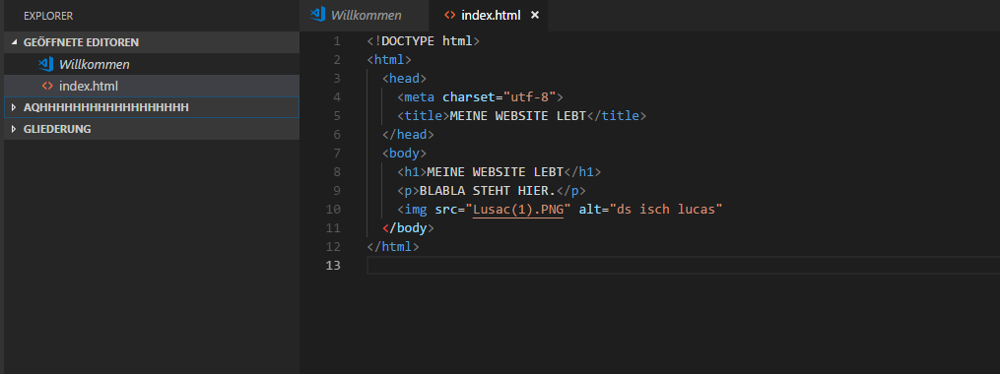

+++
title = "𝕿𝖊𝖆𝖒𝖘 𝖇𝖊𝖘𝖕𝖗𝖊𝖈𝖍𝖚𝖓𝖌 & 𝕻𝖗𝖔𝖌𝖗𝖆𝖒𝖒𝖎𝖊𝖗𝖊𝖓"
date = "2020-10-21"
draft = false
pinned = false
image = "teams-logo.png"
+++
Heute war der WEB-Unterricht spezieller als sonst. Marco Jakob, unser WEB-Lehrer, war in Quarantäne und hat uns über Teams Aufträge gegeben. Zuerst aber erhielten wir unsere Noten via Outlook. Nach einer kurzen Besprechung haben wir (Isabelle und Ich) individuell an unserem Projekt gearbeitet. Wir haben erste entwürfe für unsere Website erstellt und uns überlegt wie und wo wir das ganze machen. Mit kleiner Beratung von Marco haben wir entschieden die Website selber zu programmieren. So haben wir am meisten Freiheiten was das Design und die Funktionen angeht. \
\
Nach der Besprechung mit Marco über unser Projekt, haben wir uns weiter mit dem Programmieren-Tutorial von Marco auseinandergesetzt und gelernt einfache Seiten zu programmieren. 

\
\
Es war ein kleiner Rückblender, dass arbeiten über Teams, so wie es während dem Lockdown im Frühling war. So könnte es bald auch wieder sein. Weshalb ich mich schon wieder darauf vorbereite.