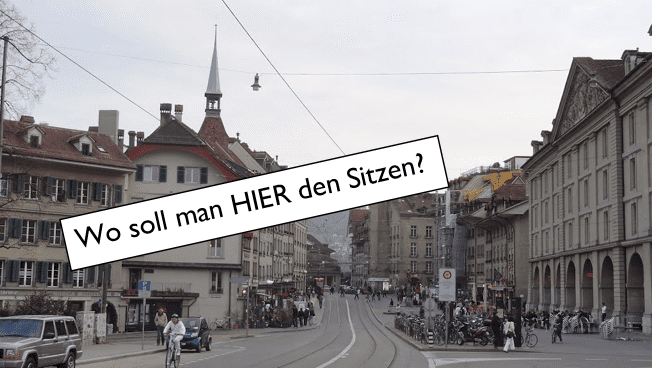

+++
title = "𝓟𝓻𝓸𝓫𝓵𝓮𝓶𝓮 𝓾𝓷𝓭 𝓑𝓮𝓭ü𝓻𝓯𝓷𝓲𝓼𝓼𝓮"
date = "2020-08-26"
draft = false
pinned = false
image = "eee.png"
+++
Isabelle und ich sind heute unter die Leute gegangen und haben sie gefragt, was den so ein Problem von Ihnen gerade ist. Wir waren auf dem Kornhausplatz in Bern. Dort erhielten wir einige spannende Antworten:

* Es habe zu wenig Sitzmöglichkeiten hier und vor allem bei den Bushaltestellen.
* Der Klimawandel
* Die Masken trage Pflicht würde nicht eingehalten werden.

  

Gleichzeitig haben wir den Leuten auch Fragen zu unserer Idee gestellt und sie gefragt wie sie diese finden würden. Wir haben diese nach Altersgruppen ausgesucht. Die jüngeren haben eher gesagt, dass es sicherlich witzig wäre. Die ältere Bevölkerung, wusste teilweise gar nicht was wir meinten, mit Fake-News und Photoshop. Sie haben kein Interesse gezeigt an unserer Idee. 

Aufgezeigt hat dieses nur das, dass die jüngeren eventuell sogar unsere Website besuchen würden. Wenn wir das auch gut machen könnten. Die ältere Bevölkerung jedoch würde diese Website nicht besuchen. Also so wie wir zwei uns das Vorgestellt haben.