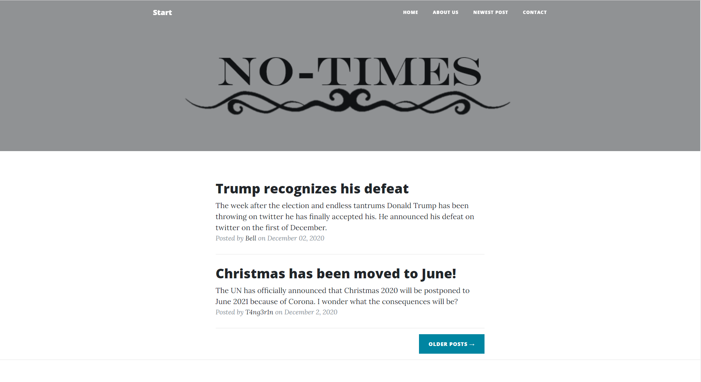

+++
title = "Unsere Website & Erster Beitrag?!"
date = "2020-12-02"
draft = false
pinned = false
image = "no-timeslogo.png"
+++
## Unsere Website

Es ist endlich soweit! Wir haben angefangen mit unserer Website. Ich habe dazu eine Vorlage genommen und diese nun angefangen zu überarbeiten und zu erweitern. Es ist zwar noch ein langer Weg noch bis Sie fertig ist. jedoch freuen wir uns schon jetzt, dass wir schon soweit sind. <https://notimes.netlify.app> Dies ist der Link zum Prototypen unserer Website. Man sieht, dass es eine Art Online-Zeitung werden soll. 

## Erster Beitrag geschrieben

Isabelle hat nebenbei den ersten Beitrag geschrieben. Vorerst auf Englisch, da wir International werden wollen. Für sie war es aber kein grosses Problem. Am Schluss hat Sie den Text noch auf Deutsch übersetzt. Das Thema könnt Ihr ja auf unserer Website nachschauen, wenn es euch interessiert. Der zweite Beitrag ist auch schon in Arbeit.