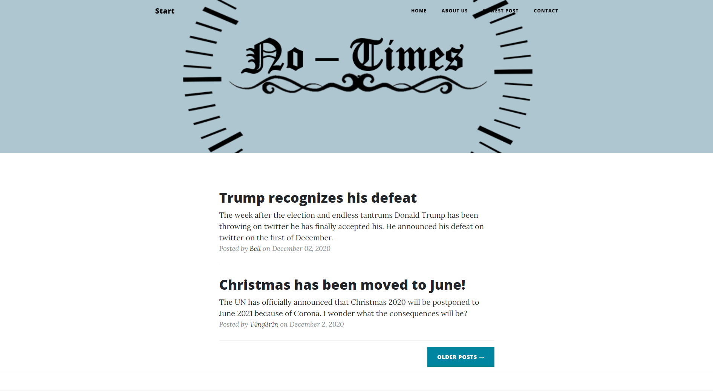

+++
title = "Website wächst"
date = "2020-12-09"
draft = false
pinned = false
image = "no-timeslogonew.png"
+++
## Unsere Website wächst

Ich habe heute an unserer Website weitergearbeitet. Unteranderem hat Sie nun eine Seite für die älteren Posts sowie eine Suchfunktion. Ich habe auch die Kontakt-Seite bearbeitet und ein Button eingebaut wo man uns direkt eine Mail schreiben könnte. Und noch vieles mehr. Vieles am Design. Schaut doch selber: <https://notimes.netlify.app>

## 2. Beitrag

Isabelle hat sich derweilen um das Logo und den 2. Beitrag gekümmert. So wie beim 1. Beitrag wollten wir möglichst zeitnah am geschehen sein.